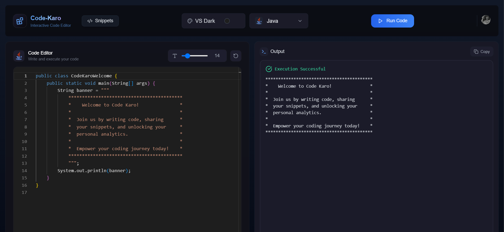
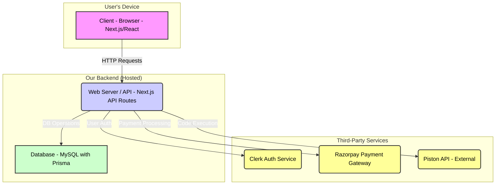
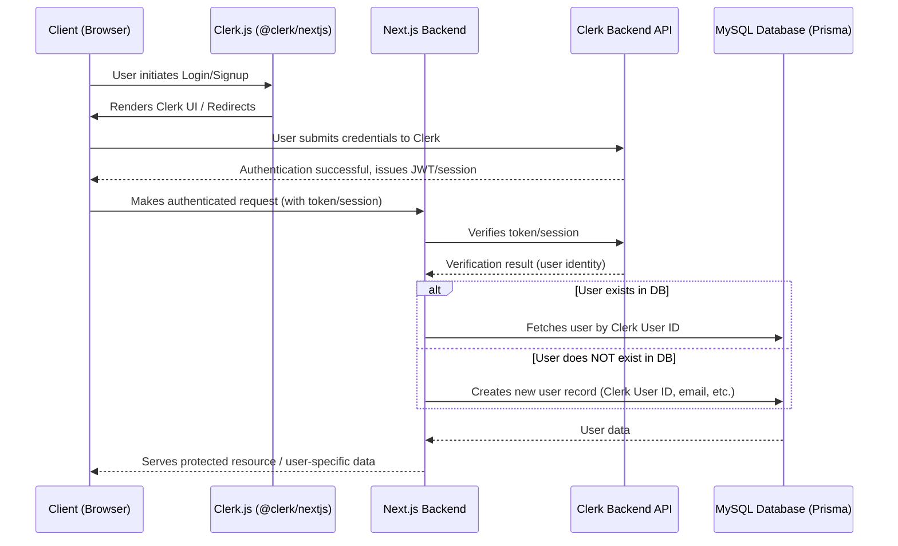
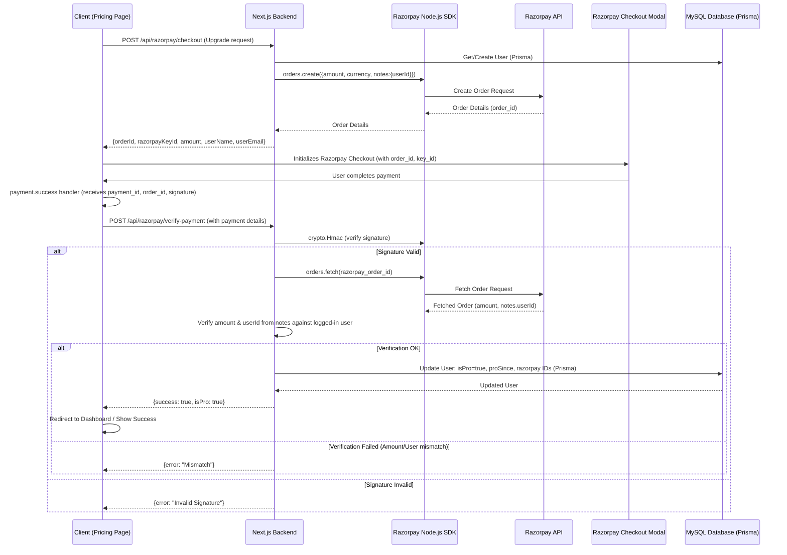
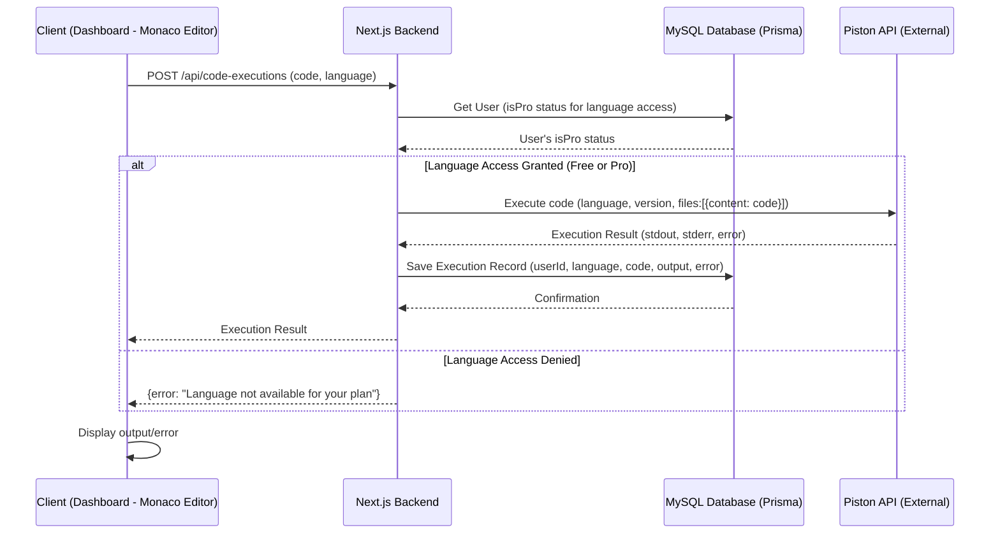
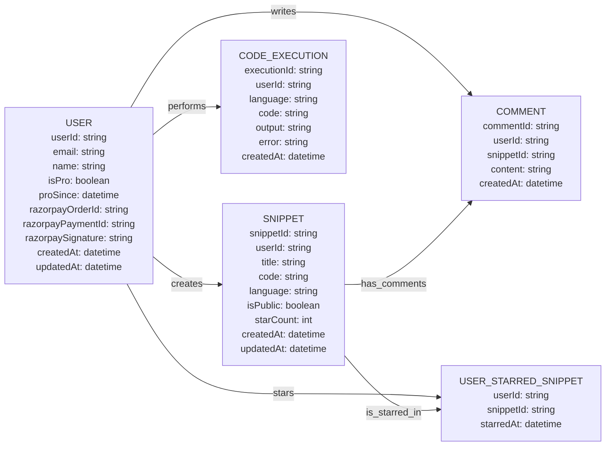

# 💻 Code Karo (SQL Edition)

> 🚀 An interactive, multi-language **online code editor** with real-time execution, snippet sharing, user profiles with analytics, and a **Pro plan powered by Razorpay** to unlock advanced features.

---



---

## ✨ Key Features

### 🧠 Advanced Code Editor

- 🛠️ Supports multiple programming languages:
  - **Free Tier:** JavaScript, Java, C++
  - **Pro Tier:** Access to all available languages (Python, Go, Rust, C#, Ruby, Swift, TypeScript, etc.)
- 🎨 Switchable editor themes (VS Dark, VS Light, GitHub Dark, Monokai, Solarized Dark)
- ⚙️ Real-time code execution via Piston API integration
- ↔️ Auto-formatting for various languages on paste and via shortcut (Shift+Alt+F)

### 💳 Pro Membership & Payments

- 🌟 **Unlock Pro Features:** Gain access to all programming languages by upgrading to Pro.
- 🇮🇳 Integrated with **Razorpay** for seamless and secure payments (500 INR for Pro).
- ✅ Secure payment verification flow.
- 📈 Pro status reflected across the application, including profile page and editor.

### 🔐 Authentication (Clerk)

- 🔑 Easy Login & Signup using [Clerk](https://clerk.dev).
- 🔒 Secure session management.

### 📤 Snippet Sharing

- 📎 Share code snippets (public/private - to be implemented based on original plan).
- ⭐ Star and favorite snippets.
- 💬 Comment on shared snippets.
- 🔍 Filter snippets by language, author, or name.

### 👤 Profile Dashboard

- ✨ **Pro Member** badge displayed for upgraded users.
- 📊 Shows number of snippets created and starred.
- 📈 Analytics of languages used, including last 24 hours activity.
- 🏆 Most used language and execution history.
- 🎨 Dynamic UI to view developer activity and statistics.

## 📊 System Architecture & Flows

Here's a visual overview of the Code Karo (SQL Edition) system architecture and key operational flows.

### 1. High-Level System Architecture



### 2. User Authentication Flow (Clerk)



### 3. Pro Plan Payment Flow (Razorpay)



### 4. Code Execution Flow



### 5. Database ER Diagram (Conceptual)

This diagram shows the main entities and their relationships within the MySQL database, managed by Prisma.



---

## ⚙️ Tech Stack

| Layer        | Tech Used                                                               |
| ------------ | ----------------------------------------------------------------------- |
| 🖥️ Frontend  | Next.js (App Router), React.js, TypeScript, Tailwind CSS, Monaco Editor |
| 🔧 Backend   | Next.js API Routes, TypeScript                                          |
| 💽 Database  | MySQL (managed with Prisma ORM)                                         |
| 🔐 Auth      | Clerk                                                                   |
| 💸 Payments  | Razorpay                                                                |
| 🚀 Execution | Piston API (for running code in various languages)                      |
| 🎨 UI Tools  | TailwindCSS, Framer Motion, Lucide Icons, Custom Theme Configurations   |

---

## 🧑‍💻 Developed By

**Rudrakshi Sharma**
📧 rudrakshisharma86@gmail.com
🔗 [GitHub](https://github.com/itsrudra143)

---

## 🏁 Getting Started

1.  **Prerequisites:**

    - Node.js (v18+ recommended)
    - npm/yarn/pnpm
    - MySQL database instance

2.  **Clone the repository:**

    ```bash
    git clone https://github.com/itsrudra143/codekaro # Or your specific fork/repo
    cd codekaro/codekaro-sql
    ```

3.  **Install dependencies:**

    ```bash
    npm install
    # or
    yarn install
    # or
    pnpm install
    ```

4.  **Set up environment variables:**

    - Rename the `.env.sample` file in the `codekaro-sql` directory to `.env.local`.

    ```bash
    # On Windows (PowerShell)
    Rename-Item .env.sample .env.local/.env

    # On macOS/Linux
    mv .env.sample .env.local
    ```

    - Open the newly created `.env.local/.env` file and update the placeholder values with your actual keys and URLs.

5.  **Apply database migrations:**

    - Ensure your MySQL server is running and the database specified in `DATABASE_URL` exists.

    ```bash
    npx prisma migrate dev
    npx prisma generate
    ```

6.  **Run the development server:**
    ```bash
    npm run dev
    # or
    yarn dev
    # or
    pnpm dev
    ```
    The application should now be running on [http://localhost:3001](http://localhost:3001) (or your `NEXT_PUBLIC_APP_URL`).

---

## 🚀 Deployment

(Details about deploying the Next.js application, configuring environment variables on the hosting platform, and setting up the database would go here.)

---

## 🤝 Contributing

(Contribution guidelines, if any.)
